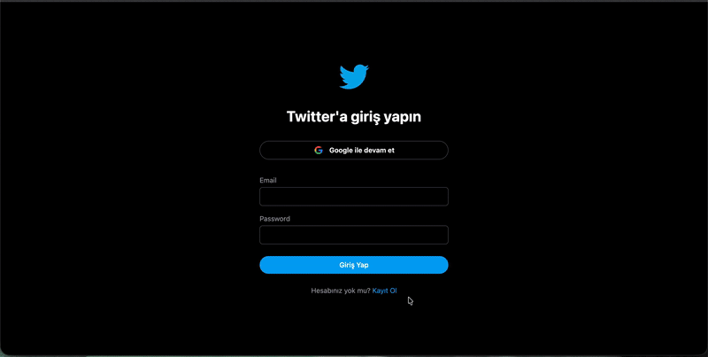

# 🐦 Twitter Clone — Firebase + React

Bu proje, temel Twitter işlevlerini taklit eden sade ve modern bir sosyal medya uygulamasıdır.  
Kullanıcı girişi, tweet paylaşma, tweet beğenme, görsel yükleme ve gündem listesi gibi özellikler içerir.

---

## ✨ Özellikler

### 🔐 Firebase Authentication

- Google ile giriş
- E-posta / şifre ile kayıt
- Şifre sıfırlama
- Oturum takibi

### 📝 Tweet Paylaşma

- Metin tweet atma
- Cloudinary ile görsel yükleme
- Tweetleri gerçek zamanlı Firestore'a kaydetme
- Tweet silme (üç nokta menüsünden)

### ❤️ Tweet Beğenme

- Like / Unlike
- Anlık Firestore güncellemeleri
- Beğeni sayısı gösterimi

### 👤 Kullanıcı Profili Alanı

- Google profil fotoğrafı desteği
- Kullanıcı adı / etiket alanı
- Çıkış yapma butonu

### 📌 Gündemler (Aside)

- Statik trend listesi
- Twitter’a benzer modern görünüm
- Arama alanı

### 🎨 Arayüz (UI)

- TailwindCSS ile modern tasarım
- Dark tema
- Hover efektleri
- Responsive tasarım
- Twitter benzeri layout (Nav – Feed – Aside)

---

## 🛠️ Kullanılan Teknolojiler

- **React**
- **Vite**
- **Firebase Authentication**
- **Firebase Firestore**
- **Cloudinary**
- **React Router**
- **React Icons**
- **TailwindCSS**
- **Moment.js**
- **React Toastify**

---

## 🎥 Proje Ekran GIF

Aşağıda uygulamanın genel görünümü yer almaktadır:

---
